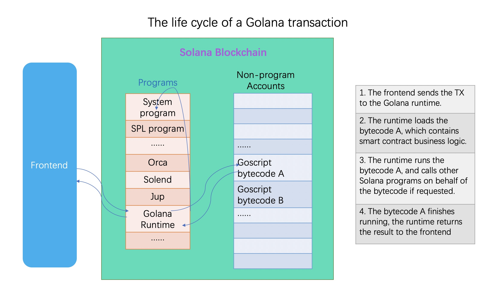

# What is Golana

## From users' perspective

From users' perspective, Golana is simply another SDK for Solana, akin to Anchor. It allows you to build, test, and deploy smart contracts written in Go, eliminating the need to learn Rust for Solana development if you are already familiar with Go.

## Internals

The relationship between Golana and Solana is similar to the relationship between Java and Windows.

With a VM (written in C/C++) that runs on Windows and supports Java bytecode, the Java SDK enables people to build Java programs that run on Windows. In the case of Golana, it functions as an ordinary Solana Program, while it allows developers to create smart contracts in Go by embedding a Goscript VM (written in Rust) that executes Goscript bytecode.

## Tools

Golana (the Solana program) is deployed on the blockchain, so you don't need to make any preparations to access it. However, you do need to install the Golana SDK, which contains tools that can generate templates, run test cases, and deploy your Golana project.

## Goscript vs Go

Goscript closely follows the official pre-1.18 Go specifications, so you should not notice any differences. However, the support for the standard library is rather limited, and goroutines are disabled due to Solana's constraints.
